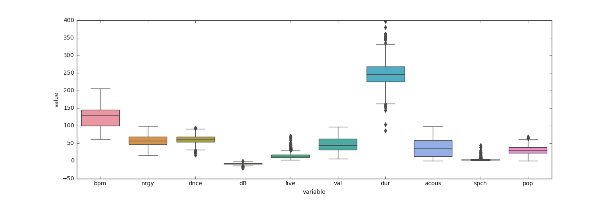
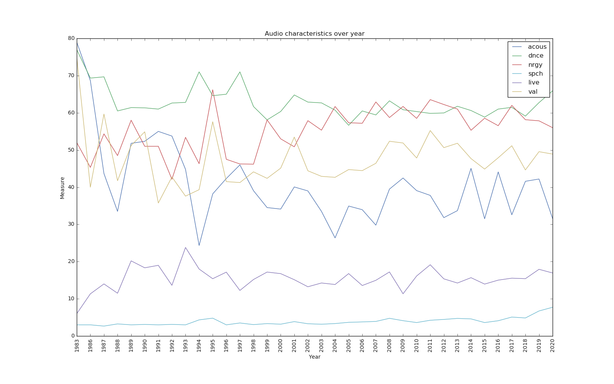
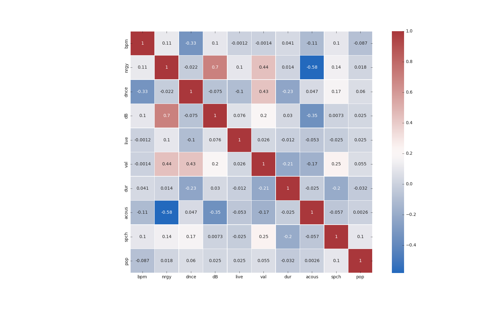

# Recommend Song Base on Clustering :Project Overview
* Created a tool that recommends the songs by using audio features to help the people to find the thai song base on their preference.
* Optimized the Kmean algorithm using the Elbow method , Silhouette Score to compare between the original data and the data that have been transform form the PCA method.
* Built a simple website using Flask and deployed on heroku.

## Code and Resources
**Python Version**: 3.8

**Packages**: pandas, numpy, sklearn, matplotlib, seaborn, altair, flask, pickle 

**Data Source** : http://organizeyourmusic.playlistmachinery.com/#

**Deploy ML model on webpage tutorial** : https://www.youtube.com/watch?v=i3RMlrx4ol4&t=487s 

**Push the Flasks Apps to Heroku tutorial** : https://www.youtube.com/watch?v=Li0Abz-KT78&t=526s

## Data Cleaning
* Removed the unwanted column.
* Droped the duplicates songs
* Removed non thai song
* Extracted the added year and month of the song

## EDA
I look at the boxplot and see that some faetures have the different magnitude. Below are a few highlight from thr EDA notebook.

## Model Building
First, I standardize the data because the data have different magnitude then I created the new data that come from the PCA method of 2 components.

I tried two different methods in evaluating the clustering that is elbow method and silhouette score. I choose the data from the PCA method because it has fewer distortion scores and more silhouette scores.

two different model:
* **Kmeans from the original data**: number of cluster = 17, distortion score = 4017.89, average silhouette score = 0.12 
* **Kmeans from the PCA data**: number of cluster = 11, distortion score = 616.158, average silhouette score = 0.33 

## Productionization
In this step, I build a flask web application that was hosted on a cloud by Heroku. The web takes a request for the audio feature values. You can either enter the value by yourself or select the range between a little to a lot in the audio feature and input the genre you mostly like. The web will return a list of songs in the same cluster and the songs that have the same cluster and same genre that you choose.

**Web** :https://chinsongrecommend.herokuapp.com/
